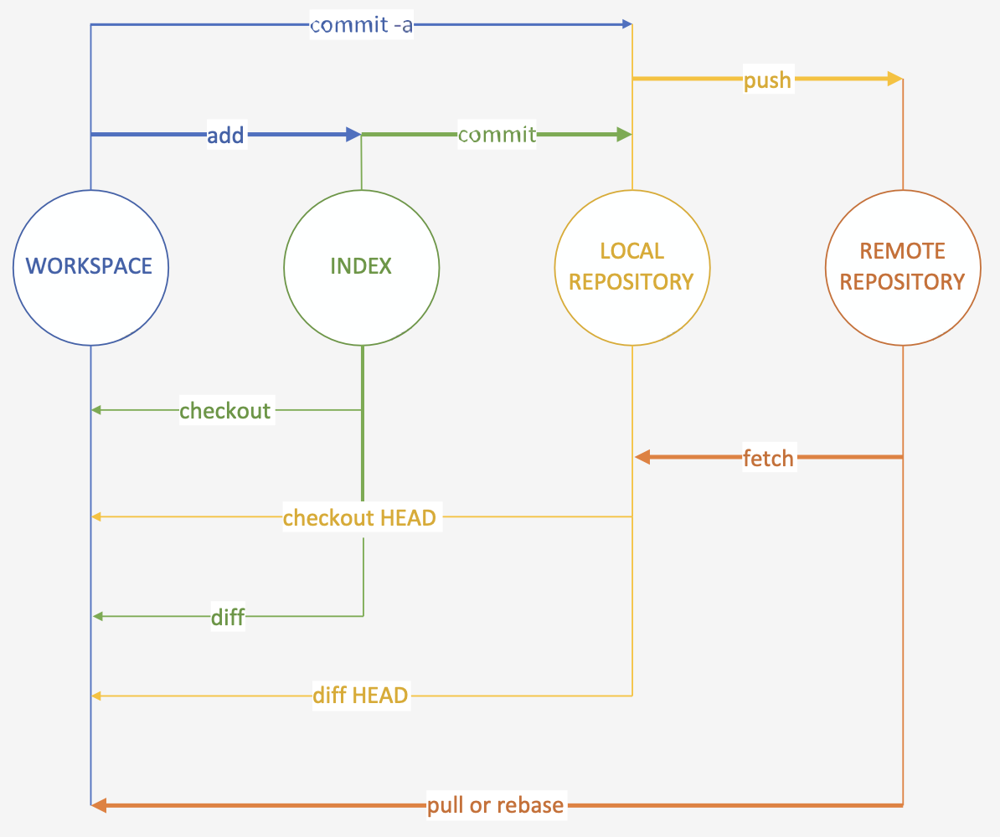

# Git workflow

* The programmer adds (indexes) the file: `git add <file_name>`
* Places it in the local repository: `git commit -m "message regarding the file"`
* Gets the current status of updates of remote repository: `git fetch`
* Gets the current content of remote repository: `git pull`
* Sends the code to the remote repository: `git push`

